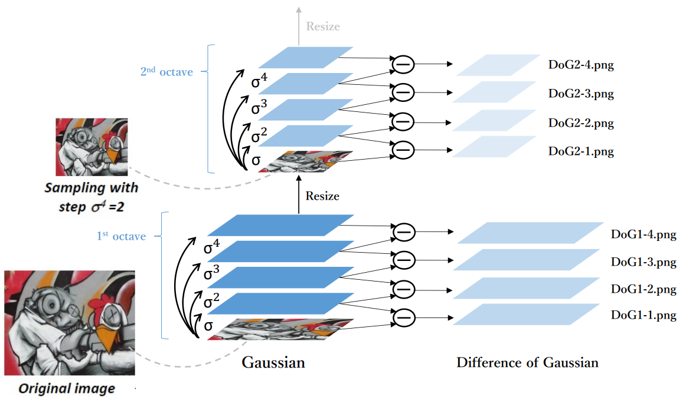
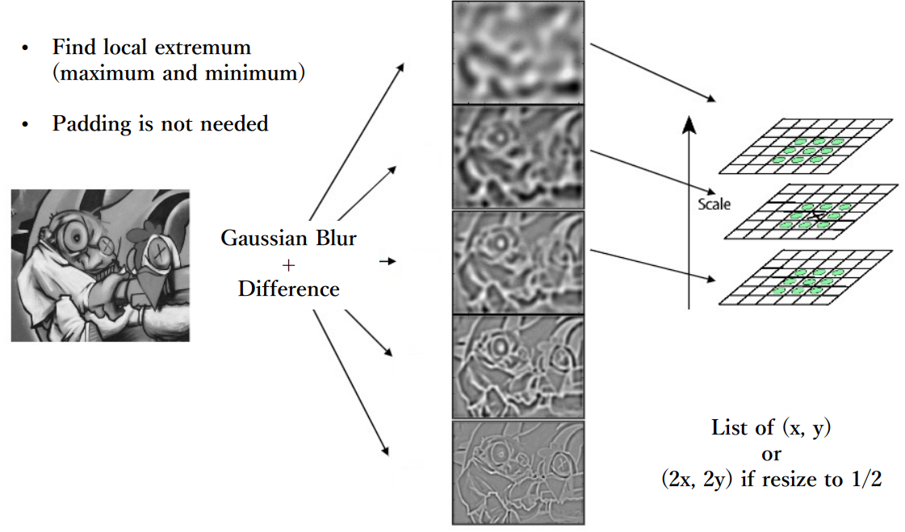
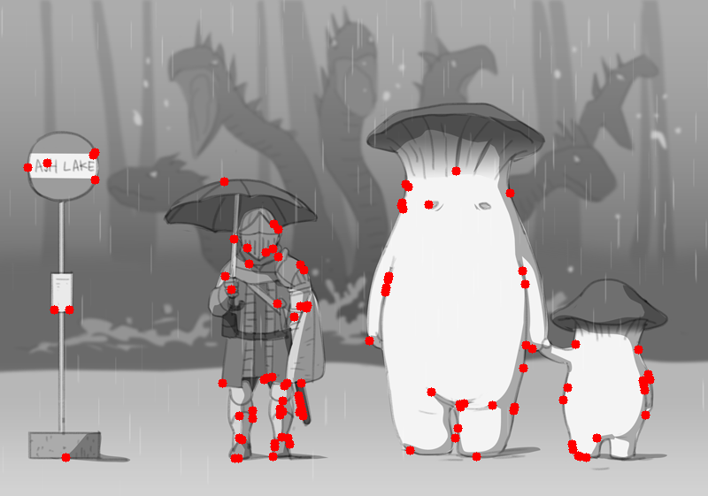
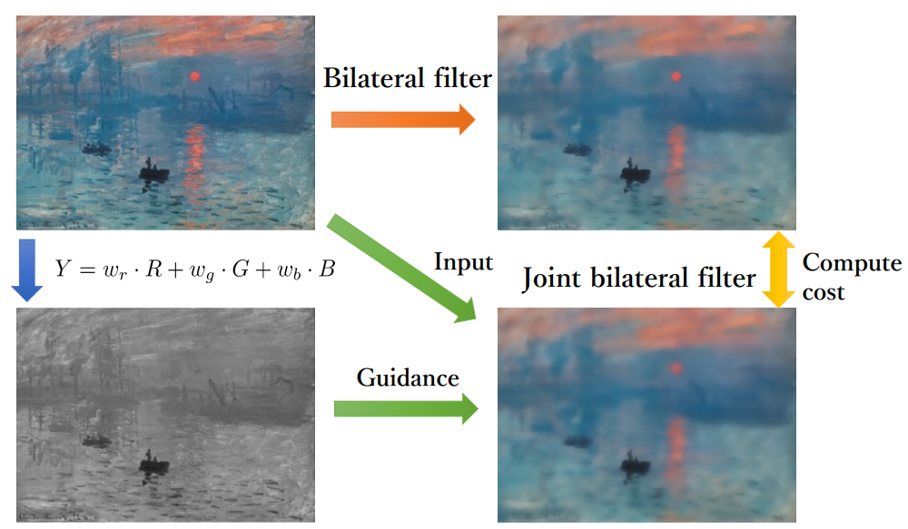

# Difference of Gaussian and bilateral-filter
A impletment for Scale Invariant Feature Detection (DOG)






A impletment for Joint bilateral filter (JBF)


org


demo


## Usage
### Requirement (prerequisite: conda)
Type the following command in your terminal, you should have conda to build the environment

```sh
git clone https://github.com/willychen0146/Difference-of-Gaussian-and-bilateral-filter.git
cd Difference-of-Gaussian-and-bilateral-filter
# build the environment
bash build.sh
```
### Difference of Gaussian (DoG)


```sh
cd Part1
# you can change image path and threshold if you want.
python main.py --image_path ./testdata/1.png --threshold 5.0
# check whether all keypoints were match.
python eval.py
cd ..
```
### bilateral filter
```sh
cd Part2
# you can change image path and setting path if you want.
python main.py --image_path ./testdata/1.png --setting_path ./testdata/1_setting.txt
# check time consuming and whether have any error.
poetry run python garticio_selenium/app.py
cd ..
```